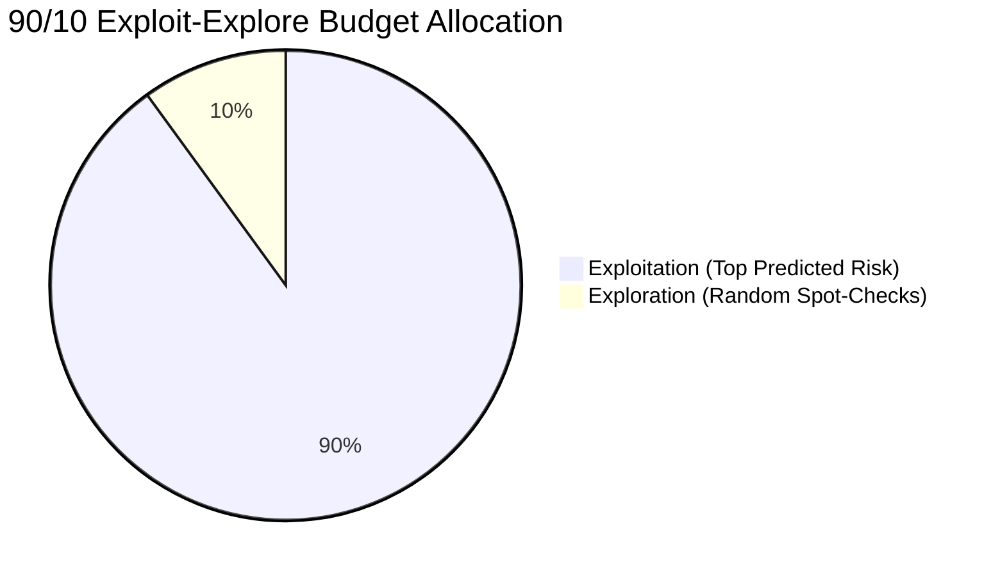
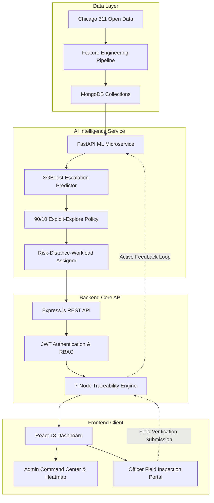

# Future Complaint Prediction

[](LICENSE)
[](https://nodejs.org/)
[](https://www.python.org/)
[](https://fastapi.tiangolo.com/)
[](https://react.dev/)
[](https://www.mongodb.com/)
[](https://xgboost.readthedocs.io/)

> **Proactive Civic Complaint Forecasting with Resource-Constrained Verification, Spatial-Temporal Intelligence, and Active Feedback Loops.**

---

## 📑 Table of Contents
1. [Project Overview](#project-overview)
2. [Problem Statement](#problem-statement)
3. [Motivation](#motivation)
4. [Objectives](#objectives)
5. [Dataset Information](#dataset-information)
6. [Data Preprocessing](#data-preprocessing)
7. [Feature Engineering](#feature-engineering)
8. [Prediction Target](#prediction-target)
9. [Machine Learning Approach](#machine-learning-approach)
10. [Models Used](#models-used)
11. [Evaluation Metrics & Results](#evaluation-metrics--results)
12. [Risk & Priority Prediction](#risk--priority-prediction)
13. [Resource-Constrained Verification (Exploitation vs Exploration)](#resource-constrained-verification-exploitation-vs-exploration)
14. [Resource Allocation & Officer Assignment](#resource-allocation--officer-assignment)
15. [Project Workflow & Architecture](#project-workflow--architecture)
16. [Technology Stack](#technology-stack)
17. [Project Structure](#project-structure)
18. [Installation Instructions](#installation-instructions)
19. [How to Run the Project](#how-to-run-the-project)
20. [Example API Usage](#example-api-usage)
21. [Limitations](#limitations)
22. [Future Improvements](#future-improvements)
23. [Authors & Contributors](#authors--contributors)

---

## 🌟 Project Overview

**Future Complaint Prediction** is an end-to-end civic intelligence and machine learning platform engineered to forecast municipal 311 service request spikes before they escalate. Moving municipal operations from purely reactive ticket-handling to proactive, risk-aware urban management, the system:
1. Forecasts weekly complaint escalation risk across city community areas using spatial-temporal gradient boosting.
2. Formulates resource-constrained officer verification policies balancing exploitation (dispatching to highest-risk clusters) and exploration (randomized spot-checks to eliminate selection bias).
3. Optimizes multi-officer operational dispatch using composite risk-distance-workload heuristics.
4. Enforces closed-loop relational auditability across predictions, assignments, field verifications, and evaluation benchmarks.

---

## ❓ Problem Statement

Traditional municipal 311 systems operate **reactively**: citizens report infrastructure issues (e.g., potholes, streetlight outages, illegal dumping, graffiti) only after severe disruption occurs. This leads to:
- Compounding infrastructure deterioration and backlog spikes.
- Inefficient officer routing with ad-hoc field dispatching.
- **Feedback-selection bias**: dispatching field inspectors exclusively to historically high-complaint areas blinds municipal leaders to latent, emerging risk in underreported neighborhoods.

---

## 💡 Motivation

Proactive governance requires anticipating infrastructure pressure points before civic distress accumulates. By analyzing multi-year spatial-temporal service request records, municipal administrators can dispatch inspectors proactively. However, real-world deployment operates under **strict resource constraints** (limited inspectors and work shifts). This system provides an algorithmic foundation that maximizes civic issue discovery while reducing officer travel distances and balancing departmental workloads.

---

## 🎯 Objectives

1. **Spatial-Temporal Forecasting**: Accurately predict next-week complaint escalation probabilities across all 77 Chicago Community Areas for top service request categories.
2. **Mitigate Selection Bias**: Implement an active exploration verification policy (90% exploitation / 10% exploration) to prevent model confirmation bias and discover emerging risks.
3. **Optimized Officer Dispatch**: Assign verified candidates to field inspectors using a multi-criteria objective (Risk, Distance, Workload Balance).
4. **End-to-End Enterprise Architecture**: Deliver a robust 3-tier system consisting of a FastAPI AI service, an Express.js / MongoDB REST API with strict RBAC, and an interactive React/Vite operational dashboard.

---

## 📊 Dataset Information

The system utilizes official **Chicago 311 Service Requests** data spanning **2020 through 2025**:
- **Geographic Coverage**: 77 Chicago Community Areas.
- **Temporal Resolution**: Weekly aggregations across 52 weeks/year.
- **Top 10 Service Request Categories**:
  - `Graffiti Removal`
  - `Street Light Out`
  - `Alley Light Out`
  - `Pothole in Street`
  - `Abandoned Vehicle`
  - `Garbage Cart Maintenance`
  - `Rodent Baiting`
  - `Tree Debris`
  - `Sanitation Code Violation`
  - `Building Violation`
- **Total Evaluated Candidate Windows**: 39,270 weekly community area observation units.

> [!NOTE]
> The automated data acquisition script is located at `backend/ai_service/download_chicago_311.py`.

---

## 🧹 Data Preprocessing

1. **Temporal Structuring**: Grouping raw timestamps into ISO calendar weeks (`week_start`, `week_end`, `year`, `week_number`).
2. **Spatial Alignment**: Mapping latitude/longitude coordinates to official Chicago Community Area boundaries and computing geographic centroids.
3. **Missing Value Treatment**: Zero-filling non-reported weekly combinations to preserve complete spatial-temporal continuity.
4. **Outlier & Spike Normalization**: Robust rolling scaling to handle holiday anomalies and seasonal weather surges.

---

## ⚙️ Feature Engineering

The feature pipeline (`backend/ai_service/feature_engineering_mongodb.py`) constructs rich spatial-temporal representations:

| Feature Category | Description | Features Included |
| :--- | :--- | :--- |
| **Temporal / Cyclical** | Captures seasonality and calendar cycles | `month`, `week_of_year`, `sin_week`, `cos_week`, `is_summer`, `is_winter` |
| **Lagged Counts** | Historical complaint volume | `lag_1_week`, `lag_2_weeks`, `lag_3_weeks`, `lag_4_weeks` |
| **Rolling Statistics** | Windowed statistics over 4, 8, and 12 weeks | `rolling_mean_4w`, `rolling_std_4w`, `rolling_max_4w`, `rolling_min_4w`, `rolling_mean_8w`, `rolling_mean_12w` |
| **Momentum & Acceleration**| Velocity of complaint surges | `complaint_growth_rate`, `momentum_4w_vs_12w`, `surge_indicator` |
| **Spatial Spillovers** | Neighboring community area dynamics | `neighbor_mean_complaints`, `centroid_latitude`, `centroid_longitude` |

---

## 🎯 Prediction Target

The primary machine learning objective is binary **Escalation Prediction** for the immediate subsequent week:

$$\text{escalation\_target} = \begin{cases} 1 & \text{if } \text{future\_complaint\_count} \ge 1.5 \times \text{rolling\_mean\_4\_weeks} \\ 0 & \text{otherwise} \end{cases}$$

- **Target Distribution**: ~23.3% positive escalation events across 39,270 validation records.

---

## 🤖 Machine Learning Approach

The modeling pipeline enforces strict chronological splitting to eliminate future lookahead leakage:
- **Training Period**: Historical years 2020–2023.
- **Validation Period**: Year 2024 (used for threshold tuning and calibration).
- **Test Period**: Out-of-time backtesting across 52 weeks of 2025.

---

## 🔬 Models Used

1. **Persistence Baseline**: Predicts escalation if the current week experienced an escalation.
2. **Frequency Baseline**: Predicts based on historical community area base rates.
3. **Logistic Regression**: Standard L2-regularized linear classification with standard scaling.
4. **Random Forest Classifier**: Ensemble of 100 decision trees with balanced subsampling.
5. **XGBoost Classifier (Production)**: Gradient boosted decision trees optimized with log-loss objective and calibrated probability outputs.

---

## 📈 Evaluation Metrics & Results

### Model Benchmark Comparison (Out-of-Time Test Set — Year 2025)

| Model | Split | Accuracy | Precision | Recall | F1-Score | ROC-AUC | PR-AUC | Brier Score |
| :--- | :--- | :---: | :---: | :---: | :---: | :---: | :---: | :---: |
| **Persistence Baseline** | Test | 88.40% | 0.9341 | 0.9372 | 0.9356 | 0.6716 | 0.9319 | 0.1160 |
| **Frequency Baseline** | Test | 89.98% | 0.8998 | 1.0000 | 0.9473 | 0.5000 | 0.8998 | 0.1002 |
| **Logistic Regression** | Test | 91.04% | 0.9228 | 0.9826 | 0.9518 | 0.9000 | 0.9876 | 0.1328 |
| **Random Forest** | Test | 91.38% | 0.9224 | **0.9873** | 0.9537 | 0.9042 | 0.9881 | 0.1007 |
| **XGBoost (Production)** | **Test** | **91.59%** | **0.9263** | 0.9849 | **0.9547** | **0.9086** | **0.9887** | **0.0622** |

> **Key Takeaway**: XGBoost delivers the best probability calibration (lowest Brier Score: `0.0622`) and highest discriminative performance (`90.86% ROC-AUC`, `98.87% PR-AUC`).

---

## 🚨 Risk & Priority Prediction

Predictions are categorized into calibrated operational risk tiers:
- 🔴 **HIGH RISK** ($P \ge 0.70$): Immediate priority dispatch candidate; imminent escalation expected.
- 🟡 **MEDIUM RISK** ($0.40 \le P < 0.70$): Escalation watch; monitored for spatial spillover.
- 🟢 **LOW RISK** ($P < 0.40$): Normal baseline activity; eligible for randomized exploratory spot-checks.

---

## 🔍 Resource-Constrained Verification (Exploitation vs Exploration)

Under real-world field constraints, verification budgets are capped at $K \in \{5\%, 10\%, 20\%\}$ of weekly candidates.

### Exploit-Only vs. Exploit-Explore Policy (90/10 Split)



### Empirical Discovery Results (52-Week 2025 Test Set)

| Verification Budget | Policy | Unique Areas Covered | Discovered Escalations | Latent Low-Risk Escalations Found | Top-10% Concentration |
| :---: | :--- | :---: | :---: | :---: | :---: |
| **5% Budget** | Exploit-Only | 32 | 169 | 0 | 21.88% |
| **5% Budget** | **Exploit-Explore (90/10)** | **68 (+36)** | **187 (+18)** | **16** | **10.29% (-11.6%)** |
| **10% Budget** | Exploit-Only | 49 | 382 | 0 | 14.29% |
| **10% Budget** | **Exploit-Explore (90/10)** | **76 (+27)** | **447 (+65)** | **97** | **9.21% (-5.1%)** |
| **20% Budget** | Exploit-Only | 61 | 879 | 0 | 11.48% |
| **20% Budget** | **Exploit-Explore (90/10)** | **77 (+16)** | **921 (+42)** | **90** | **9.09% (-2.4%)** |

> **Finding**: Allocating 10% of inspection capacity to exploration expands geographic coverage across almost all 77 community areas and discovers up to **+65 additional emerging escalations** that would otherwise be missed.

---

## 👮 Resource Allocation & Officer Assignment

Candidate locations selected for inspection are assigned to departmental field officers using multi-objective optimization:

$$\text{Composite Score} = 0.40 \cdot \text{Normalized Risk} + 0.30 \cdot (1 - \text{Normalized Distance}) + 0.30 \cdot (1 - \text{Normalized Workload})$$

### Backtested Officer Assignment Benefits

| Verification Budget | Policy | Mean Travel Distance | Workload Imbalance | Escalation Discovery Preserved |
| :---: | :--- | :---: | :---: | :---: |
| **5% Budget** | Risk + Distance + Workload | **7.56 km (-15.3%)** | 0.453 | **100% (Identical)** |
| **10% Budget** | Risk + Distance + Workload | **8.30 km (-14.0%)** | **0.355 (-6.7%)** | **100% (Identical)** |
| **20% Budget** | Risk + Distance + Workload | **9.18 km (-9.4%)** | **0.303 (-2.8%)** | **100% (Identical)** |

---

## 🔄 Project Workflow & Architecture

The complete system enforces 7-node relational traceability across the entire lifecycle:



---

## 🛠 Technology Stack

### Machine Learning & AI Microservice
- **Language**: Python 3.10+
- **Framework**: FastAPI, Uvicorn
- **ML & Data Libraries**: XGBoost 2.0+, Scikit-learn 1.3+, Pandas, NumPy, Joblib

### Backend API
- **Runtime**: Node.js v20+ / v22+
- **Framework**: Express.js 4.21+
- **Database**: MongoDB 7.0+ with Mongoose 8.9+ ODM
- **Security & Auth**: JSON Web Tokens (JWT), Bcrypt.js, Helmet, Express-Rate-Limit, CORS
- **Testing**: Native Node.js Test Runner (`node:test`, `node:assert`, Supertest)

### Frontend Dashboard
- **Library**: React 18, Vite
- **Routing**: React Router DOM v6
- **Styling**: Vanilla CSS Design Tokens, Glassmorphism, CSS Modules
- **Data Visualization**: Chart.js, React-Chartjs-2, Leaflet Interactive Maps

---

## 📁 Project Structure

```
future-complaint-prediction/
├── backend/
│   ├── ai_service/                      # Python ML & AI Microservice
│   │   ├── app/
│   │   │   ├── main.py                  # FastAPI server entrypoint
│   │   │   ├── model_service.py         # Prediction & assignment engine
│   │   │   └── schemas.py               # Pydantic request/response schemas
│   │   ├── build_final_dataset.py       # Dataset synthesis pipeline
│   │   ├── create_officer_pool.py       # Simulated officer pool generation
│   │   ├── download_chicago_311.py      # Chicago 311 data downloader
│   │   ├── feature_engineering_mongodb.py # Spatial-temporal feature builder
│   │   ├── officer_assignment.py        # Composite assignment algorithm
│   │   ├── requirements.txt             # Python dependencies
│   │   ├── run_experiments.py           # ML benchmark evaluation
│   │   └── run_verification_experiment.py # Exploit-explore simulation
│   │
│   ├── src/                             # Express.js REST API
│   │   ├── config/                      # Database & Security configs
│   │   ├── controllers/                 # Auth, Admin, Officer, Heatmap handlers
│   │   ├── middleware/                  # JWT, RBAC, IDOR protection, validation
│   │   ├── models/                      # 10 Mongoose schemas
│   │   ├── routes/                      # API v1 route definitions
│   │   ├── services/                    # Business logic & relational lifecycle
│   │   ├── utils/                       # Response handlers, JWT helpers, sanitizers
│   │   ├── app.js                       # Express app configuration
│   │   └── server.js                    # HTTP server entrypoint
│   ├── docs/                            # OpenAPI 3.0 specs & architecture docs
│   ├── seed/                            # Database seed scripts
│   ├── tests/                           # 17 automated test suites
│   ├── .env.example                     # Backend environment template
│   └── package.json
│
├── frontend/                            # React 18 Frontend Application
│   ├── src/
│   │   ├── api/                         # Axios client integrations
│   │   ├── components/                  # UI components (Heatmap, Dashboards, Tables)
│   │   ├── context/                     # Auth and Theme context providers
│   │   ├── pages/
│   │   │   ├── admin/                   # Admin Command Center pages
│   │   │   ├── officer/                 # Officer Portal pages
│   │   │   ├── LandingPage.jsx          # Public landing overview
│   │   │   └── LoginPage.jsx            # Authentication page
│   │   ├── styles/                      # Theme variables, glassmorphic stylesheets
│   │   ├── App.jsx                      # Main router setup
│   │   └── main.jsx                     # Vite mount entrypoint
│   ├── .env.example                     # Frontend environment template
│   ├── package.json
│   └── vite.config.js
│
├── .gitignore                           # Git ignore rules
└── README.md                            # Complete project documentation
```

---

## 📦 Installation Instructions

### Prerequisites
- [Node.js](https://nodejs.org/) (v20.0.0 or higher)
- [Python](https://www.python.org/) (v3.10 or higher)
- [MongoDB](https://www.mongodb.com/) (v7.0 or higher, running locally on port `27017`)
- [Git](https://git-scm.com/)

### 1. Clone the Repository
```bash
git clone https://github.com/Monish-Pandian/future-complaint-prediction.git
cd future-complaint-prediction
```

### 2. Configure Environment Files

**Backend Environment**:
```bash
cp backend/.env.example backend/.env
```

**Frontend Environment**:
```bash
cp frontend/.env.example frontend/.env
```

### 3. Install Backend Dependencies
```bash
cd backend
npm install
```

### 4. Install AI Microservice Dependencies
```bash
cd backend/ai_service
python -m venv .venv
# On Windows:
.venv\Scripts\activate
# On Linux/macOS:
# source .venv/bin/activate

pip install -r requirements.txt
```

### 5. Install Frontend Dependencies
```bash
cd ../../frontend
npm install
```

---

## 🚀 How to Run the Project

### Step 1: Start MongoDB
Ensure MongoDB is running locally on `mongodb://127.0.0.1:27017/civic_forecasting`.

### Step 2: Seed Initial Database Records (Optional)
```bash
cd backend
npm run seed
```

### Step 3: Launch AI Microservice
```bash
cd backend/ai_service
# Activate virtual environment
.venv\Scripts\activate
uvicorn app.main:app --host 127.0.0.1 --port 8000 --reload
```
*AI Service will be active at `http://127.0.0.1:8000` (Swagger docs: `http://127.0.0.1:8000/docs`).*

### Step 4: Launch Backend REST API
```bash
cd backend
npm run dev
```
*Backend API will be active at `http://localhost:5000`.*

### Step 5: Launch Frontend Application
```bash
cd frontend
npm run dev
```
*Frontend UI will be active at `http://localhost:5173`.*

---

## 💻 Example API Usage

### 1. Authenticate Admin User
```bash
curl -X POST http://localhost:5000/api/v1/auth/login \
  -H "Content-Type: application/json" \
  -d '{
    "email": "admin@cityofchicago.gov",
    "password": "AdminSecurePassword123!"
  }'
```

### 2. Trigger AI Forecast Cycle
```bash
curl -X POST http://localhost:5000/api/v1/admin/predictions/generate \
  -H "Authorization: Bearer <YOUR_JWT_TOKEN>" \
  -H "Content-Type: application/json" \
  -d '{
    "targetWeekStart": "2026-03-15T00:00:00.000Z",
    "verificationBudgetRatio": 0.10,
    "explorationRatio": 0.10
  }'
```

### 3. Retrieve Global Risk Heatmap
```bash
curl -X GET "http://localhost:5000/api/v1/heatmap/global?riskLevel=HIGH" \
  -H "Authorization: Bearer <YOUR_JWT_TOKEN>"
```

### 4. Submit Field Inspection Verification (Officer Role)
```bash
curl -X POST http://localhost:5000/api/v1/officer/verifications \
  -H "Authorization: Bearer <OFFICER_JWT_TOKEN>" \
  -H "Content-Type: application/json" \
  -d '{
    "assignmentId": "65f2a1b9c9e8d7a6b5c4d3e2",
    "actualEscalationObserved": true,
    "severityScore": 4,
    "notes": "Severe pothole cluster confirmed on North Michigan Ave corridor."
  }'
```

---

## ⚠️ Limitations

1. **Synthetic Officer Pool for Simulation**: While the Chicago 311 dataset comprises genuine historical records, the officer workforce identities and capacity bounds in backtesting simulations are synthetic.
2. **Static Shift Availability**: Simulation experiments assume fixed officer availability per cycle; real-world shifts require dynamic telematics integration.
3. **Geographic Boundaries**: The spatial model evaluates neighborhood centroids across Chicago's 77 official community areas rather than micro-meter street segments.
4. **Offline Feedback Iterations**: Model retraining in the current pipeline is triggered in periodic batch cycles rather than continuous online gradient updates.

---

## 🔮 Future Improvements

- [ ] **Transformer-based Spatial-Temporal Graph Networks (ST-GNN)** for finer-grained block-level prediction.
- [ ] **Multi-Agent Reinforcement Learning (MARL)** for dynamic, real-time routing adjustments during shifts.
- [ ] **Mobile Progressive Web App (PWA)** with offline synchronization and GPS camera integration for field officers.
- [ ] **Automated Retraining Webhook Triggers** based on concept drift detection and rolling Brier Score degradation.

---

## 👥 Authors & Contributors

- **Monish Pandian** ([@Monish-Pandian](https://github.com/Monish-Pandian)) - *Lead Architecture, ML Research, Backend & Frontend Engineering*

---

## 📄 License

This project is licensed under the MIT License - see the [LICENSE](LICENSE) file for details.
