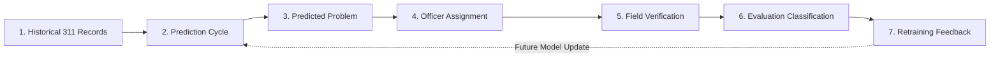

# Proactive Civic Complaint Forecasting with Resource-Constrained Verification and Feedback — Backend API

Robust, scalable Express.js REST API backend designed for municipal intelligence, complaint forecasting, resource-constrained officer dispatch, field verification, and iterative feedback loops.

---

## 🏛 Roles & Access Control
- **ADMIN**: Global municipal intelligence, citywide dashboards, global heatmaps, department/officer management, and AI dispatch triggering.
- **OFFICER**: Department-isolated operational tasks, personal assignment dashboard, field verification submission, and department-scoped heatmaps.

---

## 🛠 Tech Stack
- **Runtime**: Node.js (v20+ / v22+)
- **Framework**: Express.js (v4.21+)
- **Database**: MongoDB with Mongoose ODM (v8.9+)
- **Authentication**: JSON Web Tokens (`jsonwebtoken`) & `bcryptjs`
- **Security**: Helmet, CORS, Rate Limiting (`express-rate-limit`), NoSQL Injection Filters
- **Testing**: Native Node.js Test Runner (`node:test`, `node:assert`, Supertest/Fetch)

---

## 📁 Project Structure

```
backend/
├── docs/
│   ├── openapi.yaml              # OpenAPI 3.0.3 API Specification
│   ├── authorization-matrix.md   # Role-Based Access Control Matrix
│   ├── resource-ownership.md     # Ownership & IDOR Protection Rules
│   ├── architecture.md           # Lifecycle & Future AI Service Contract
│   ├── api-examples.md           # Concrete cURL & JSON request/response examples
│   └── postman_collection.json   # Parameterized Postman Collection (v2.1)
│
├── src/
│   ├── config/
│   │   ├── database.js           # Mongoose connection & graceful shutdown
│   │   └── security.js           # Centralized security & rate limiting config
│   ├── models/
│   │   ├── User.js               # 1. User accounts & RBAC roles (ADMIN, OFFICER)
│   │   ├── Officer.js            # 2. Officer profiles, skills & 2dsphere location
│   │   ├── HistoricalComplaint.js# 3. Past actual observations & historical source
│   │   ├── PredictionCycle.js    # 4. Forecast cycles & iteration runs
│   │   ├── Prediction.js         # 5. Predicted problem clusters & risk forecasting
│   │   ├── Assignment.js         # 6. Operational AI dispatch & verification tasks
│   │   ├── Verification.js       # 7. Actual field inspection observations
│   │   ├── Evaluation.js         # 8. Prediction vs. observation comparison
│   │   ├── Feedback.js           # 9. Learning signals for future cycle improvements
│   │   ├── SystemSetting.js      # 10. Dynamic platform operational configuration
│   │   └── index.js              # Central models registry
│   ├── controllers/              # Request handlers (auth, admin, officer, heatmap, health)
│   ├── services/                 # Business logic & 7-node relational engine
│   ├── routes/                   # API v1 routes aggregator
│   ├── middleware/               # Auth, RBAC, ownership, department isolation, NoSQL filters
│   ├── validators/               # Input validation schemas & sanitizers
│   ├── utils/                    # Error classes, response utilities, JWT tokens
│   ├── app.js                    # Express app setup and middleware configuration
│   └── server.js                 # HTTP server entrypoint
│
├── seed/
│   └── index.js                  # Master seed script (npm run seed)
├── tests/                        # 17 automated test suites (168 tests)
│   ├── helpers/
│   │   └── factories.js          # Reusable test data factories
│   └── securityAudit.test.js     # Security test matrix
├── SECURITY.md                   # Security policies and access-control architecture
├── .env.example                  # Example development environment variables
├── .env.test.example             # Example isolated test environment variables
├── package.json
└── README.md
```

---

## ⚙️ Environment Variables

Create a `.env` file in the root directory (based on `.env.example`):

| Variable | Description | Default |
| :--- | :--- | :--- |
| `PORT` | HTTP server port | `5000` |
| `NODE_ENV` | Environment mode (`development` / `production` / `test`) | `development` |
| `MONGO_URI` | MongoDB connection string | `mongodb://127.0.0.1:27017/civic_forecasting` |
| `JWT_SECRET` | Secret key for signing JWT tokens | `<secret_key>` |
| `JWT_EXPIRES_IN` | JWT token validity duration | `7d` |
| `CLIENT_URL` | Allowed frontend client URL for CORS | `http://localhost:5173` |
| `ML_SERVICE_URL` | Microservice URL for forecasting engine | `http://127.0.0.1:8000` |

---

## 🚀 Quick Start

### 1. Install Dependencies
```bash
npm install
```

### 2. Seed Realistic Data
```bash
npm run seed
```

### 3. Run Development Server
```bash
npm run dev
```

### 4. Run Automated Test Suite
```bash
npm test
```

### 5. Run Test Coverage
```bash
npm run test:coverage
```

---

## 🔄 End-to-End Operational Lifecycle

The system enforces complete 7-node relational traceability:



---

## 🤖 Future AI Service Boundary

> [!NOTE]
> The AI Service (XGBoost / Spatial Forecasting Service) communicates with the backend exclusively through the REST API (`POST /api/v1/admin/predictions`). The AI Service will never connect directly to MongoDB, preserving authorization and audit invariants.

---

## 📖 Complete Documentation Index

- **OpenAPI 3.0 Specification**: [`docs/openapi.yaml`](file:///e:/Projects/FutureCommplaintF-B/backend/docs/openapi.yaml)
- **Role Authorization Matrix**: [`docs/authorization-matrix.md`](file:///e:/Projects/FutureCommplaintF-B/backend/docs/authorization-matrix.md)
- **Resource Ownership & IDOR Rules**: [`docs/resource-ownership.md`](file:///e:/Projects/FutureCommplaintF-B/backend/docs/resource-ownership.md)
- **System Architecture & Lifecycle Contract**: [`docs/architecture.md`](file:///e:/Projects/FutureCommplaintF-B/backend/docs/architecture.md)
- **cURL Usage Examples**: [`docs/api-examples.md`](file:///e:/Projects/FutureCommplaintF-B/backend/docs/api-examples.md)
- **Postman Collection**: [`docs/postman_collection.json`](file:///e:/Projects/FutureCommplaintF-B/backend/docs/postman_collection.json)
- **Security Policies**: [`SECURITY.md`](file:///e:/Projects/FutureCommplaintF-B/backend/SECURITY.md)
