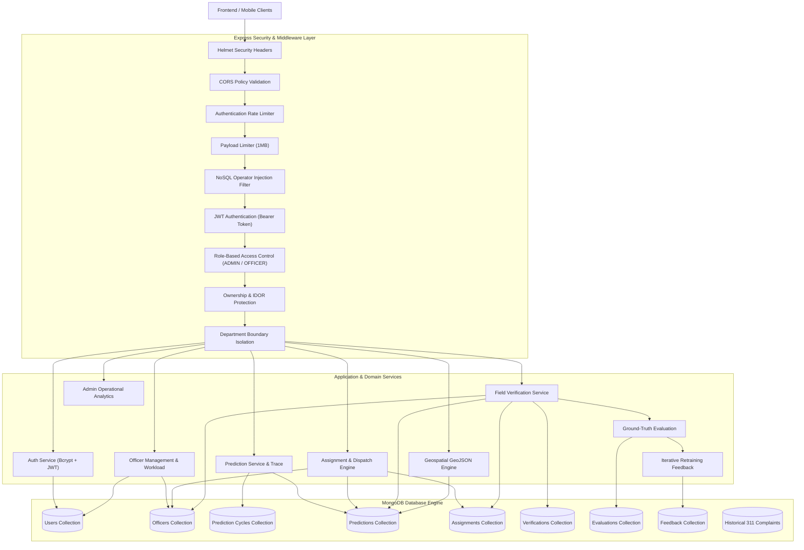
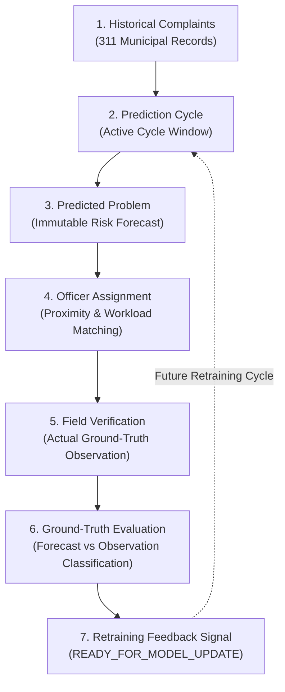
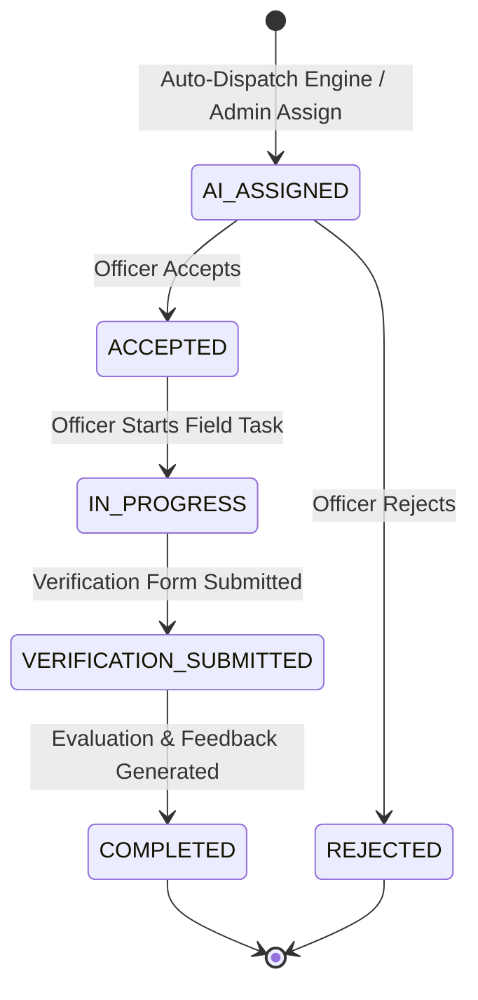
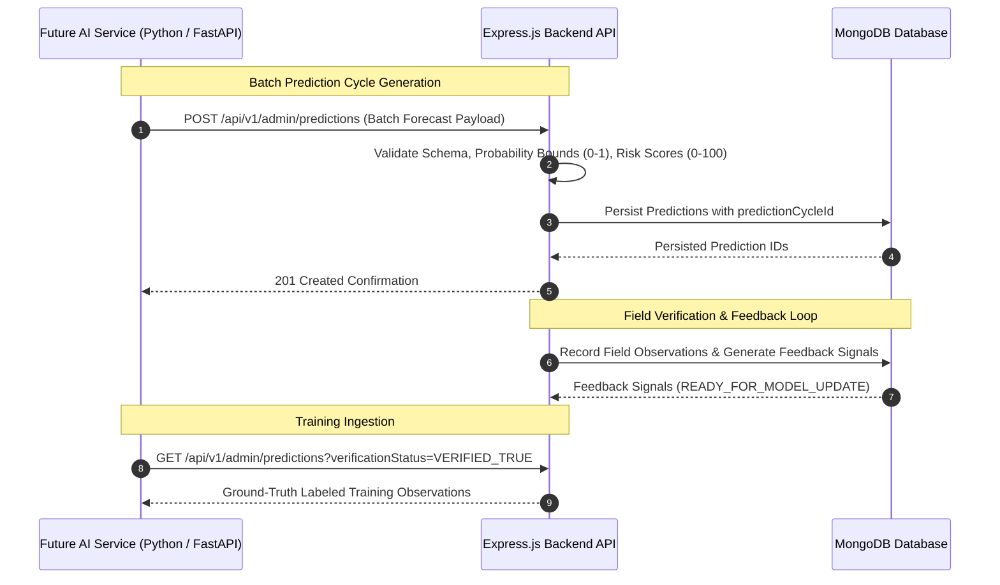

# Backend System Architecture & Lifecycle Contract

This document provides a comprehensive technical overview of the backend architecture, data relationships, lifecycle state machines, and future AI service boundaries.

---

## 1. High-Level Backend Architecture



---

## 2. End-to-End Operational Lifecycle & 7-Node Traceability

The system maintains complete 7-node relational traceability from historical complaint ingestion to ground-truth feedback generation.



---

## 3. Assignment State Machine



### Transition Invariants
- `AI_ASSIGNED` $\rightarrow$ `ACCEPTED` $\rightarrow$ `IN_PROGRESS` $\rightarrow$ `VERIFICATION_SUBMITTED` $\rightarrow$ `COMPLETED`
- Direct jumps from `COMPLETED` $\rightarrow$ `IN_PROGRESS` or `AI_ASSIGNED` $\rightarrow$ `COMPLETED` are rejected (`400 Bad Request`).

---

## 4. Verification Outcomes & Evaluation Classification

| Verification Outcome | Description | Resulting Evaluation | Resulting Feedback Type |
|---|---|---|---|
| `PROBLEM_CONFIRMED` | Field inspection confirms forecasted issue exists | `TRUE_POSITIVE` | `VERIFIED_OBSERVATION` |
| `PROBLEM_NOT_FOUND` | No issue observed at predicted location | `FALSE_POSITIVE` | `FALSE_POSITIVE_SIGNAL` |
| `DIFFERENT_PROBLEM` | Different issue observed than predicted | `FALSE_POSITIVE` | `DIFFERENT_PROBLEM_SIGNAL` |
| `DUPLICATE` | Issue is a duplicate of a previously resolved task | `UNDETERMINED` | `DUPLICATE_REPORT` |
| `UNABLE_TO_VERIFY` | Access blocked / insufficient verification evidence | `UNDETERMINED` | `DATA_QUALITY_ISSUE` |

---

## 5. Future AI Service Boundary (Contract Specification)

> [!IMPORTANT]
> **Future Boundary Specification**: The machine learning model integration (XGBoost / Random Forest / Spatial Forecasting Service) will communicate with the Express backend via REST API ingestion. The ML service will **never** connect directly to MongoDB.



### Ingestion Contract (Future AI Service $\rightarrow$ Express Backend)

```json
{
  "predictionCycleId": "CYCLE-2026-W34",
  "complaintType": "Pothole Wave",
  "department": "Streets & Sanitation",
  "communityArea": "Near North Side",
  "ward": "Ward 42",
  "location": {
    "type": "Point",
    "coordinates": [-87.6298, 41.8781]
  },
  "probability": 0.88,
  "riskScore": 85.0,
  "riskLevel": "HIGH",
  "confidence": 0.92,
  "historicalCount": 14,
  "recentCount": 8,
  "trend": "INCREASING",
  "predictionWindowStart": "2026-08-26T00:00:00.000Z",
  "predictionWindowEnd": "2026-09-02T00:00:00.000Z"
}
```
